# Godot Project Template
This repository serves as a quickstart template for game development with Godot 4.4+ using GDExtension.

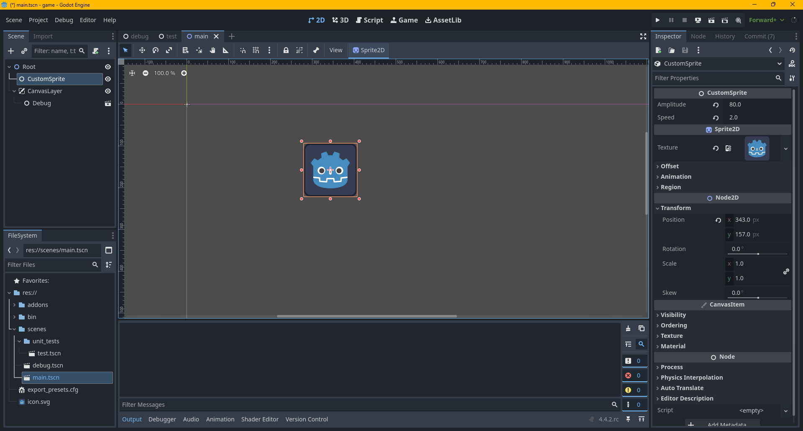
> Godot C++ GDExtension tutorial implemented in the project.

## Features
* **Setup Script** - download and install prerequisites.
* **Visual Studio Solution File** - generate a visual studio sln file with separate project files for the godot engine and the game GDExtension project.
* **Visual Studio Platforms** - `android` (defaults to arm64 but this can be changed), `linux` (WSL), `web`, `win32`, and `win64`.
* **Configurations** - `editor`, `editor_game`, `development`, `template_debug`, `template_release`, `profile` and `production`.
* **Project** - setup using the [gdextension_cpp_example](https://docs.godotengine.org/en/4.4/tutorials/scripting/gdextension/gdextension_cpp_example.html) godot tutorial.
* **Engine Submodules** - `godot` and `godot-cpp` as submodules (tracking the respective 4.4 branches).
* **GitHub Bug Report Template** - issues template (`.github/ISSUE_TEMPLATE.yml`) for bug reports.
* **Automatic Build And Export** - CI scripts to build and export the game for different platforms.
* **Generate GDExtension Documentation** - automatically generate `.xml` files in a `doc_classes/` directory to be parsed by Godot as [GDExtension built-in documentation](https://docs.godotengine.org/en/4.4/tutorials/scripting/gdextension/gdextension_docs_system.html)
* **GDExtension Plugins** - additional GDExtension plugins to demonstrate developing areas of the codebase as separate plugins linked to the main game project - see [core](./project/addons/core) and [gdextension_cpp_example](./project/addons/gdextension_cpp_example).
* **Core Plugin** - helpful C++ macros to be reused across other plugins and in the main `game` project.
* **GDExtension Doctest Support** - support for writing and running doctest unit tests from GDExtension code - see [doctest_runner](./project/addons/doctest_runner), [test_custom_sprite.h](./project/addons/gdextension_cpp_example/project/src/tests/sprite) and [run_unit_tests.py](./tools/scripts/run_unit_tests.py).
* **ImGui** - Uses [imgui-godot](https://github.com/pkdawson/imgui-godot) to provide runtime debug menus if you implement `void draw_debug();` in your node class - see [custom_sprite.cpp](./project/addons/gdextension_cpp_example/project/src/sprite/custom_sprite.cpp).
* **Tools** - toolbox app to support project development - includes build downloader, commit checker and maintanence apps.

## Project Structure

 <pre>
<a href="./engine" title="engine">engine</a>
	- <a href="./engine/godot" title="godot">godot</a>
	- <a href="./engine/godot-cpp" title="godot-cpp">godot-cpp</a>
<a href="./project" title="project">project</a>
	- <a href="./project/addons" title="project_addons">addons</a> (godot assets + game plugins)
		- <a href="./project/addons/core" title="core">core</a> (C++ helper macros)
		- <a href="./project/addons/doctest_runner" title="doctest_runner">doctest_runner</a> (doctest unit test runner node + macros)
			- <a href="./project/addons/doctest_runner/project/src/doctest_runner/doctest_runner.h" title="doctest_runner.h/.cpp">doctest_runner.h/.cpp</a> (manages children doctest nodes and quits once they are all finished)
			- <a href="./project/addons/doctest_runner/project/src/doctest_runner/doctest_runner_macros.h" title="doctest_runner_macros.h">doctest_runner_macros.h</a> (macros to declare and implement nodes in other GDExtension code)
		- <a href="./project/addons/gdextension_cpp_example" title="gdextension_cpp_example">gdextension_cpp_example</a>
			- <a href="./project/addons/gdextension_cpp_example/project/src/sprite/custom_sprite.h/.cpp" title="custom_sprite.h/.cpp">custom_sprite.h/.cpp</a>
			- <a href="./project/addons/gdextension_cpp_example/project/src/tests" title="gdextension_cpp_example_doctest_node">gdextension_cpp_example_doctest_node.h/.cpp</a> (doctest node for this plugin to be placed in test.tscn)
			- <a href="./project/addons/gdextension_cpp_example/project/src/tests/sprite/test_custom_sprite.h" title="test_custom_sprite.h">test_custom_sprite.h</a> (example doctest unit test implementation for custom_sprite.h)
	- <a href="./project/scenes" title="project_scenes">scenes</a>
		- <a href="./project/scenes/unit_tests/test.tscn" title="test.tscn">test.tscn</a> (includes doctest_runner node + children doctest nodes)
		- <a href="./project/scenes/debug.tscn" title="debug.tscn">debug.tscn</a> (includes build information + stats)
		- <a href="./project/scenes/main.tscn" title="main.tscn">main.tscn</a> (includes debug.tscn and moving custom sprite)
	- <a href="./project/src" title="project_src">src</a> (game GDExtension code)
<a href="./thirdparty" title="thirdparty">thirdparty</a>
	- <a href="./thirdparty/emsdk" title="emsdk">emsdk</a> (used for web platform)
	- <a href="./thirdparty/imgui" title="imgui">imgui</a> (used for runtime debug)
	- <a href="./thirdparty/rcedit" title="rcedit">rcedit</a> (used for windows builds)
<a href="./generate_project_files.py" title="game.sln">game.sln</a> (can build code in Visual Studio Community after generate_project_files.py finishes)
</pre> 

## Visual Studio Solution File
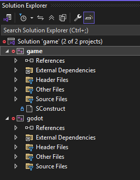
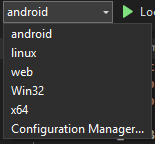
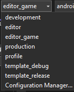  
This is generated using scons (makes an NMake project) and has been tested with Visual Studio Community 2022.

| Configuration | Description | Debug Symbols |
|---|---|---|
| `editor` | Builds the godot editor and `game` and opens the `game` project for editing. | ✅ |
| `editor_game` | Builds the godot editor and `game` and then runs the `game` project. | ✅ |
| `development` | Builds the `game` project and hot reloads the `game` GDExtension code whilst the editor is running. | ✅ |
| `template_debug` | Builds the godot editor and the `game` project intended to be attached to a running `template_debug` build of the `game`. | ✅ |
| `template_release` | Same as above but with `template_release` instead. | ❌ |
| `profile` | Same as above but for `profile` which uses `production=yes` and `debug_symbols=yes`. | ✅ |
| `production` | Same as above but for `production` which uses `production=yes` | ❌ |

> [!NOTE]  
> Debugging C++ in Visual Studio Community isn't available when running for `web` and `android`.  

> [!NOTE]  
> GDExtensions plugins located in the `addons` folder can't hot reload their C++ code whilst the editor is running.  

Below are some examples of running different platforms/configurations from the visual studio solution. The gifs are sped up for brevity.

### Editor
#### Windows
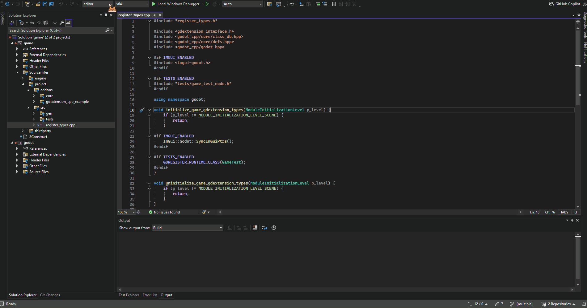

### Editor Game 
#### Windows
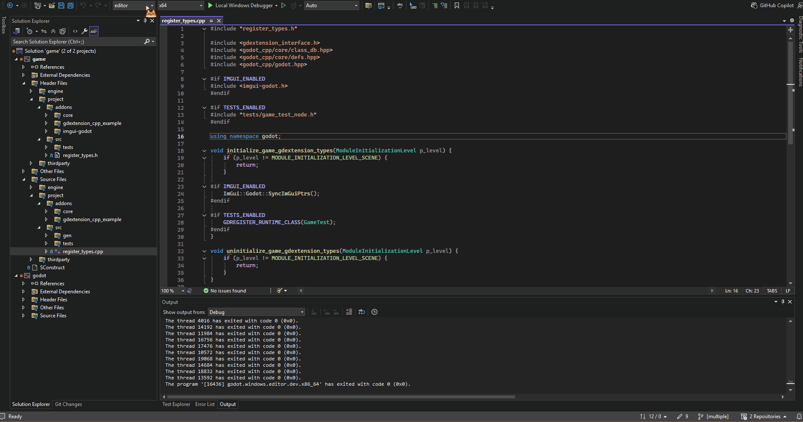

#### Web
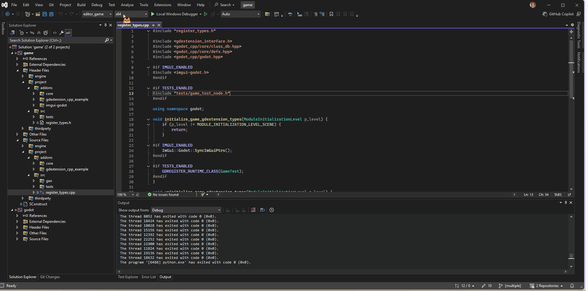

#### Android
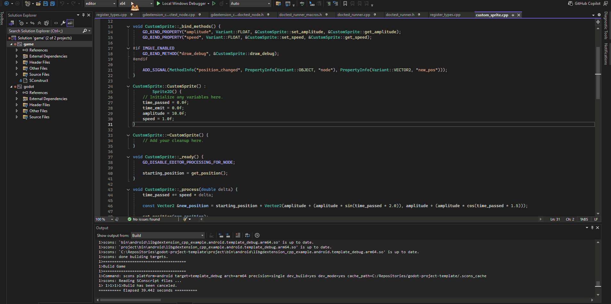
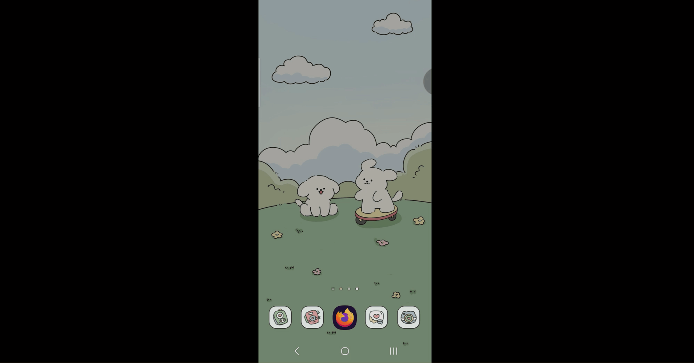

## Tools
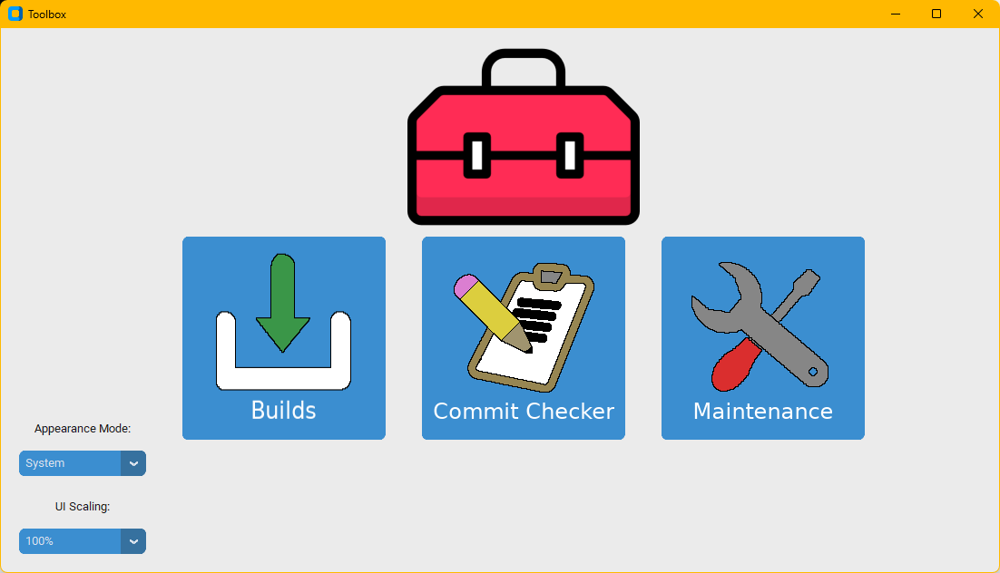

> [!NOTE]  
> These tools are implemented using python scripts but have only been tested properly on Windows OS - with some work they should be able to be cross-platform friendly.

### Builds
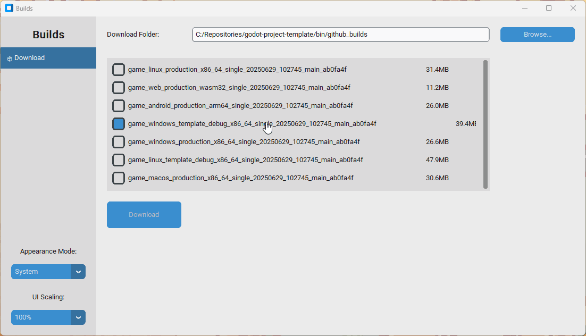
Provides a list of the saved game builds from the github actions artifacts and allows users to download them to a specified folder.

### Commit Checker
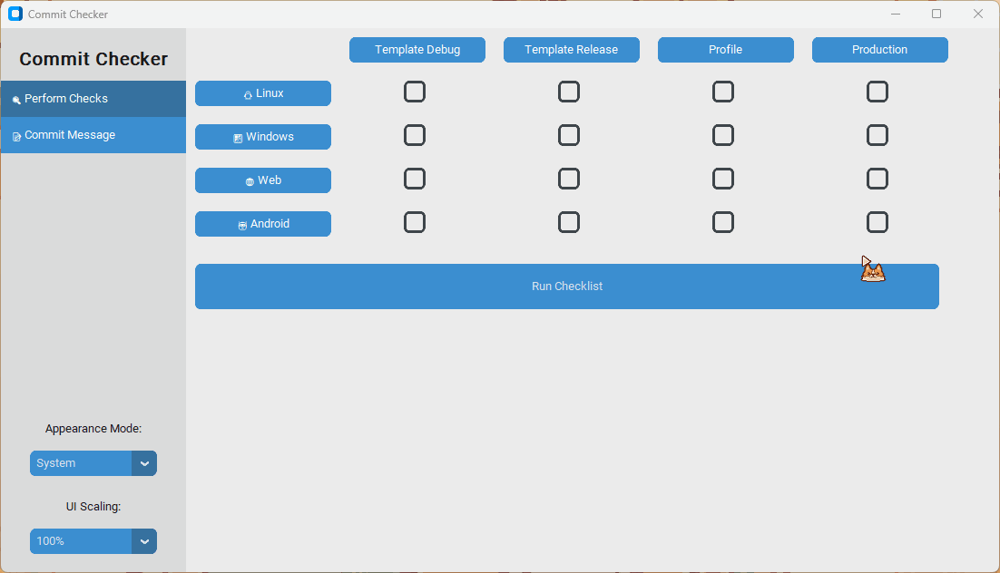
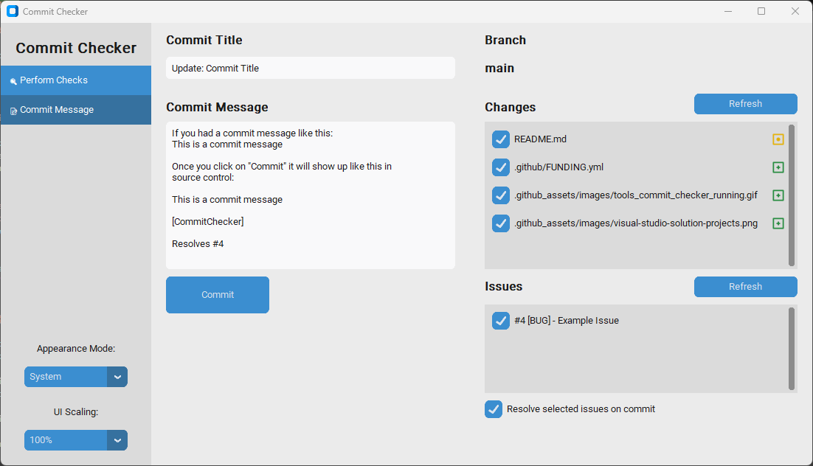
Provides a way to compile for a different platform and configuration locally and then runs unit tests and reports if these are successful or not. Also provides a way to write commit messages and link them with specific GitHub issues with the option to automatically resolve an issue once the commit is pushed.

### Maintanence
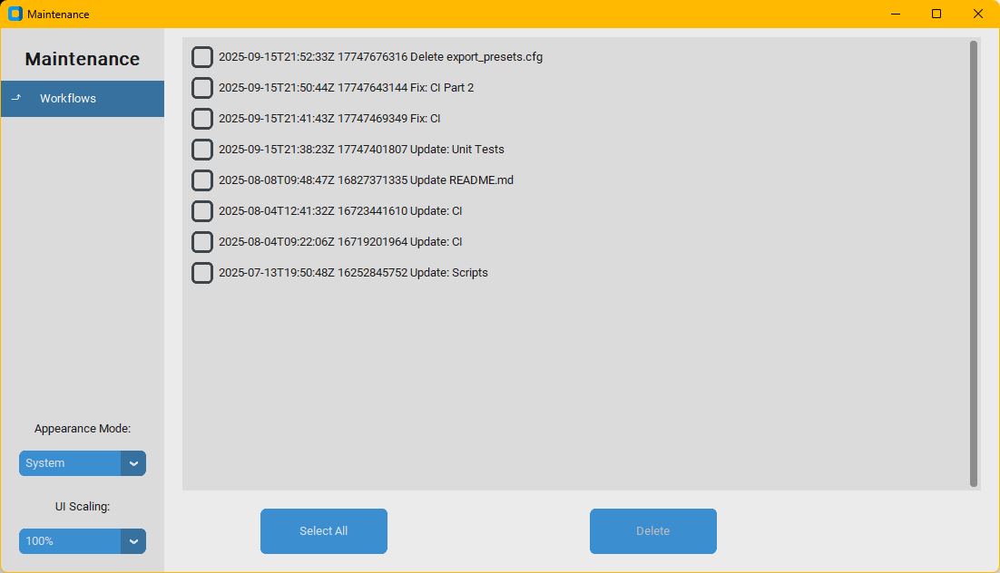
Provides a list of github workflows and allows the user to select one or multiple and delete them. I created this to help manage some of the GitHub actions/storage limits I was hitting with private repos and this is faster than having to scroll through each github workflow and manually delete it from there. Not really intended for wider use but might help some users manage their GitHub limits.
